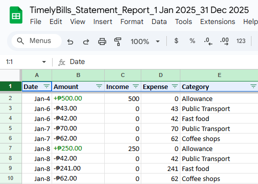
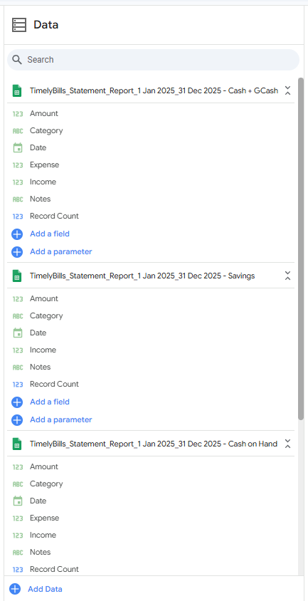
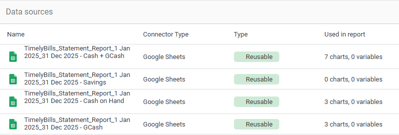
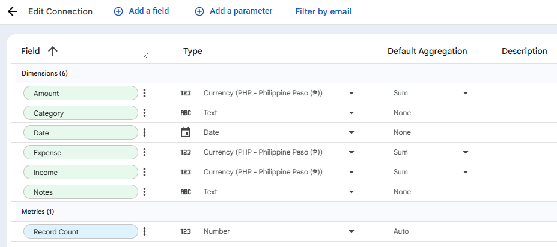
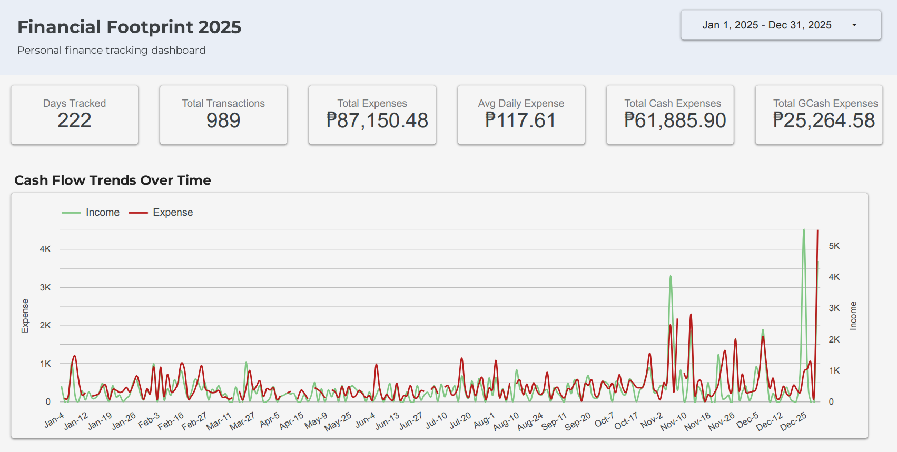
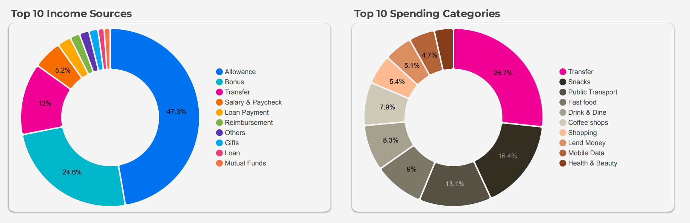
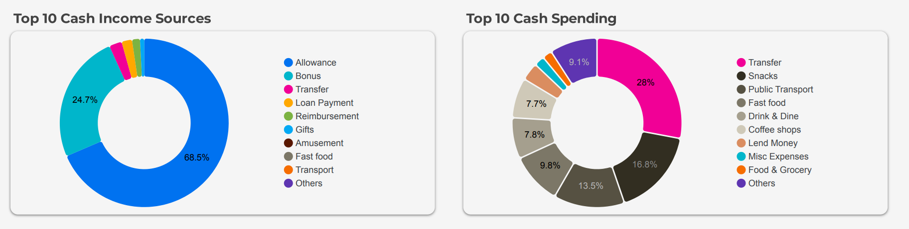
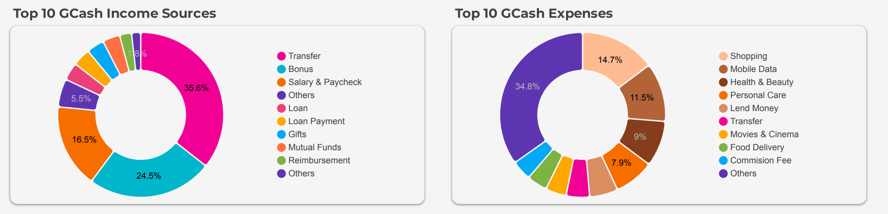

# 💰 Financial Footprint 2025

A personal finance tracking dashboard that visualizes my income, expenses, and spending patterns throughout 2025 using Google Sheets and Looker Studio.

## Project Overview

This project documents my financial journey for the entire year of 2025, tracking every transaction across different payment methods (Cash and GCash). The goal is to understand my spending habits, identify areas for improvement, and make more informed financial decisions.

**Note:** Income and savings totals have been anonymized for privacy. Only expense data is fully disclosed in this dashboard.

## Tools and Technologies

- **Data Collection:** TimelyBills App ([timelybills.app](https://www.timelybills.app/))
- **Data Processing:** Google Sheets
- **Visualization:** Google Looker Studio
- **Time Period:** January 1, 2025 - December 31, 2025
- **Total Records:** 989 transactions across 222 active days

## Live Dashboard

View the interactive dashboard here: [Financial Footprint 2025 Dashboard](https://lookerstudio.google.com/reporting/3c46f591-0af3-4c54-b431-cc96472198c8)

Alternative view: [Report View](https://lookerstudio.google.com/s/r0a8XmICdRY)

## Dataset Structure

The dataset (`TimelyBills_Statement_Report_1 Jan 2025_31 Dec 2025`) contains four tabs:

1. **Cash on Hand** - All cash transactions
2. **GCash** - All digital wallet transactions
3. **Cash + GCash** - Combined view of all transactions
4. **Savings** - Savings tracking data

### Sample Dataset



The raw data exported from TimelyBills includes Date, Amount (with + or - prefix), and Category columns. Positive amounts indicate income while negative amounts represent expenses.

### Data Processing

To separate income and expenses into individual columns, I used these Google Sheets formulas:

**Income Column (Column C):**
```
=IF(LEFT(B2,1)="+",VALUE(REGEXREPLACE(B2,"[₱+,-]","")),"0")
```

**Expense Column (Column D):**
```
=IF(LEFT(B2,1)="-",VALUE(REGEXREPLACE(B2,"[₱+,-]","")),"0")
```

These formulas check if the amount starts with a "+" or "-" sign and extract only the numeric value without currency symbols or punctuation.

### Processed Dataset



After applying the formulas, the dataset now has separate Income and Expense columns with clean numeric values, making it easier to analyze and visualize in Looker Studio.

## Dashboard Setup

### Data Sources



The dashboard connects to four Google Sheets data sources:
- **Cash + GCash** - Powers 7 charts showing overall spending patterns
- **Savings** - Reserved for future savings analysis
- **Cash on Hand** - Powers 3 charts for cash-only transactions
- **GCash** - Powers 3 charts for digital wallet transactions

### Field Configuration



Each data source contains:
- **Dimensions:** Amount, Category, Date, Expense, Income, Notes
- **Metrics:** Record Count
- All currency fields are set to Philippine Peso (₱) format with Sum aggregation

## Dashboard Components

### Overview and Key Metrics



The dashboard header displays six key performance indicators:

- **Days Tracked (222)** - Number of days with recorded transactions out of 365 days
- **Total Transactions (989)** - All income and expense entries combined
- **Total Expenses (₱87,150.48)** - Sum of all spending across the year
- **Avg Daily Expense (₱117.61)** - Average spending per active day
- **Total Cash Expenses (₱61,885.90)** - Spending using physical cash (71% of total)
- **Total GCash Expenses (₱25,264.58)** - Spending using digital wallet (29% of total)

The Cash Flow Trends Over Time chart shows daily income (green) and expenses (red) throughout the year, revealing spending patterns and income frequency.

### Overall Income and Spending Analysis



**Top 10 Income Sources:**
- Allowance dominates at 47.3%, followed by Transfer (24.6%) and Bonus (13%)
- Shows heavy reliance on regular allowances for income

**Top 10 Spending Categories:**
- Transfer (26.7%) - Largest expense, likely savings or money sent to others
- Snacks (16.4%) - Second biggest category, indicating frequent small purchases
- Public Transport (13.1%) - Daily commute costs
- Fast food (9%) and Drink & Dine (8.3%) - Combined 17.3% on food outside home

### Cash Transaction Analysis



**Cash Income Sources:**
- Heavily concentrated with Allowance at 68.5%
- Transfer and other sources make up the remaining portion

**Cash Spending:**
- Transfer (28%) - Largest cash expense
- Snacks (16.8%) - Frequent small purchases paid in cash
- Public Transport (13.5%) - Daily commute typically paid in cash
- Fast food (9.8%) - Many food vendors accept only cash

Cash remains the primary payment method for daily essentials like transportation, snacks, and small food purchases.

### GCash Transaction Analysis



**GCash Income Sources:**
- More diversified: Transfer (35.6%), Bonus (24.5%), Salary & Paycheck (16.5%)
- Shows digital payments are used for receiving various income types

**GCash Spending:**
- Others (34.8%) - Miscellaneous digital purchases
- Shopping (14.7%) - Online shopping and retail
- Mobile Data (11.5%) - Phone bills and data loads
- Health & Beauty (9%) - Personal care products

GCash usage reflects modern spending habits, with emphasis on online shopping, digital services, and subscription payments.

## My Insights and Analysis

### Spending Habits

1. **Payment Method Preference** - Cash accounts for 71% of expenses (₱61,885.90), indicating continued reliance on physical money for daily transactions. GCash is used primarily for online purchases and digital services.

2. **Category Concentration** - The top 3 categories (Transfer, Snacks, Public Transport) represent 56.2% of all spending, showing concentrated expenses in specific areas.

3. **Food-Related Expenses** - Combined spending on Snacks (16.4%), Fast food (9%), and Drink & Dine (8.3%) totals 33.7%, nearly one-third of all expenses. This presents the biggest opportunity for savings.

4. **Tracking Consistency** - Only 222 out of 365 days were tracked (60.8%), suggesting room for improvement in daily logging habits.

### Areas for Improvement

1. **Reduce Discretionary Food Spending (33.7% of expenses)**
   - Snacks and dining out are significant expenses that could be reduced
   - Consider meal planning and bringing homemade snacks
   - Set a weekly budget for eating out

2. **Clarify Transfer Category (26.7%)**
   - This is the largest expense but unclear what it represents
   - Break down into specific subcategories (savings, bills, loans, gifts)
   - Better categorization will provide clearer insights

3. **Improve Tracking Consistency**
   - 143 days without recorded transactions
   - Daily tracking would provide more accurate patterns

4. **Optimize Payment Methods**
   - Use digital payments where possible to automatically track expenses
   - Maintain small cash reserves for vendors who don't accept digital payments

### Financial Goals and Recommendations

**Short-term Goals (1-3 months):**
- Reduce snack spending by 20% through conscious consumption and meal prep
- Track expenses daily to avoid gaps in data
- Review and recategorize "Transfer" expenses for better clarity

**Medium-term Goals (3-6 months):**
- Reduce overall food expenses (snacks + dining) by 25%
- Increase GCash usage to 40% of transactions for better tracking
- Build a comprehensive budget based on identified spending patterns

**Long-term Goals (6-12 months):**
- Build an emergency fund equivalent to 3 months of average expenses (₱26,145)
- Reduce total monthly expenses by 15% through conscious spending
- Diversify income sources beyond allowances
- Achieve 90%+ tracking consistency (330+ days logged)

**Action Items:**
- Bring homemade snacks to avoid impulse purchases
- Review expenses weekly to stay accountable
- Break down large categories into specific subcategories for better insights

## Technical Implementation

### Google Sheets Setup

The data processing workflow:

1. Export transaction data from TimelyBills app to Excel format
2. Import into Google Sheets with Date, Amount, and Category columns
3. Apply income formula in Column C: `=IF(LEFT(B2,1)="+",VALUE(REGEXREPLACE(B2,"[₱+,-]","")),"0")`
4. Apply expense formula in Column D: `=IF(LEFT(B2,1)="-",VALUE(REGEXREPLACE(B2,"[₱+,-]","")),"0")`
5. Create separate sheets for Cash on Hand, GCash, Cash + GCash, and Savings
6. Connect all sheets to Looker Studio as reusable data sources

### Looker Studio Configuration

Dashboard components:

- **Scorecards (6)** - Days Tracked, Total Transactions, Total Expenses, Avg Daily Expense, Total Cash Expenses, Total GCash Expenses
- **Line Chart (1)** - Cash Flow Trends Over Time with dual axis for Income and Expense
- **Donut Charts (6)** - Two for overall breakdown, two for Cash, two for GCash
- **Date Range Control** -  Allows filtering by custom date ranges
- **Blended Data** - Combines multiple sheets for comprehensive analysis

## Future Improvements

- **Monthly Budget Tracking** - Add budget limits per category and track variance
- **Predictive Analytics** - Use historical data to forecast future spending
- **Savings Rate Visualization** - Track savings percentage over time
- **Year-over-Year Comparison** - Compare 2025 data with future years
- **Automated Data Impor:** - Explore API integration with TimelyBills for real-time updates
- **Mobile Dashboard** - Create mobile-optimized version for on-the-go monitoring
- **Category Refinement** - Break down broad categories like "Transfer" and "Others" into specific subcategories
- **Goal Progress Tracker** - Visual indicators for savings goals and spending targets

## Privacy and Data Security

Income totals and savings amounts have been anonymized to protect personal financial information. All expense data shown is actual and unmodified to provide authentic insights into spending patterns.

The dataset file is not included in this repository to maintain privacy. Only screenshots, demo datasets, and documentation are provided.

## What I Learned from my Financial Footprint

1. **Consistent tracking is crucial** - Gaps in data make analysis less reliable
2. **Categorization matters** - Generic categories like "Transfer" hide important details
3. **Small expenses add up** - Snacks and coffee represent significant spending
4. **Cash vs digital tracking** - Digital payments are easier to track automatically
5. **Visual dashboards provide clarity** - Seeing spending patterns visually drives behavioral change

## Connect

- **Dashboard:** [View Live Dashboard](https://lookerstudio.google.com/reporting/3c46f591-0af3-4c54-b431-cc96472198c8)
- **Report View:** [Alternative Dashboard View](https://lookerstudio.google.com/s/r0a8XmICdRY)

---

**Last Updated:** January 2, 2026

**Project Status:** Active - Dashboard updated with year-end 2025 data
